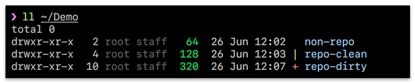
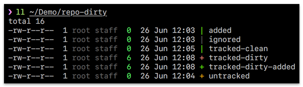

# `ll` - a more informative `ls`, based on [`k`][1]

## Description

`ll` is an alternative to [`k`][1], which was created to make directory listings more informative 
and readable, using colour to add visual weight to important information in the listing.

### Motivation

[`k`][1] only works with [`zsh`][2], and I've found that it can occasionally be a little slow
when working with large directories or with large git repositories. I was looking for a project
which would be a good match to learn/use [`nim`][3], and this seemed like a great opportunity to make 
something a little more general-purpose that could be used without the [`zsh`][2] dependency.

## Features

### Full file listing

Calling `ll` provides a full file listing for a directory, similar to calling `ls -l`.

### File weight colours

Files sizes are graded from green for small (< 1k), to red for huge (> 1mb).

Human readable files sizes can be shown by using the `-h` flag.

### "Rotting" dates

Dates fade with age, so that recently changed files/directories can be easily identified.

### Git integration

`ll` provides easy-to-understand information about the `git` status of your files/directories.

#### Git status on entire repos

When listing a directory which contains git repos, `ll` displays the active state of those repos:

#### Git status on files within a working tree

When listing files/directories within a working tree, `ll` displays the active state of each file, and the overall state for directories:

### Speed

`ll` improves on `k`'s rendering speeds. Currently `ll` is comparable to `ls` display times when using the `--no-vcs` flag. Listing git repositories and trees take a little longer, but even with large listings with many git-tracked entries `ll` is still sub-second.

## Installation

Binary distributions are planned, but for now it's possible to build and install using the following instructions.

### Requirements

- [Nim][3], minimum v0.19.0
- `make`

### Steps

Firstly install [Nim][3]. You'll need to install version 0.19 as a minimum. I personally use [`asdf`][6] to manage Nim versions on my machine. With `asdf` installed, this is as simple as calling `asdf install nim v0.19.0`.

Once Nim is installed, clone this repository. From within the cloned directory, call `make release` which will build `ll` into the working directory. Copy the resulting `ll` binary to a location in your `$PATH` (eg. `/usr/local/bin`).

## Usage

    $ ll
    
That's it. For more options, pass `--help`. Alternatively, read the [usage](src/usage.txt) file.

## Development

`ll` is developed using Github issues and [Kanban][4] (via [Waffle][5]). If you would like to
request a feature or report a bug, please add a new issue [here](https://github.com/OldhamMade/ll/issues)
and we'll do our best to address them. Please note that this is not a funded project and fixes
will be addressed on a best-effort basis.

Contributions and pull-requests are always welcome, as is constructive feedback around 
code structure, hints, tips, etc. 

## Status

- [x] Full file listing
- [x] File weight colours
- [x] "Rotting" dates
- [x] Git status on entire repos
- [x] Git status on files within a working tree
- [x] Sort output by size
- [x] Sort output by modified time
- [x] Sort output in reversed order
- [x] Options for filtering directories
- [ ] Installable via Homebrew
- [ ] Support light themes
- [ ] Support globs

### Fixes over [`k`][1]

* [`k`][1] has an odd behaviour; given `pwd` is a git-tracked directory, if you `k somedir` where `somedir` 
contains git-tracked directories but isn't itself tracked, `k` reports as though it is working inside a 
work-tree. `ll` reports this as one would expect, as though `pwd` is `somedir`. **UPDATE:** This has now
[been fixed](https://github.com/supercrabtree/k/issues/47).

### Future plans

According to the [`k`][1] source, there are future plans to colorise file permissions. If this happens,
I plan to bring those changes over. If any other enhancements are added, I hope to port those also.

I'd like to display some additional information in the summary line of the listing; I'm currently reviewing
what would be most useful.

[1]: https://github.com/supercrabtree/k
[2]: https://en.wikipedia.org/wiki/Z_shell
[3]: https://nim-lang.org
[4]: https://en.wikipedia.org/wiki/Kanban
[5]: https://waffle.io
[6]: https://github.com/asdf-vm/asdf
